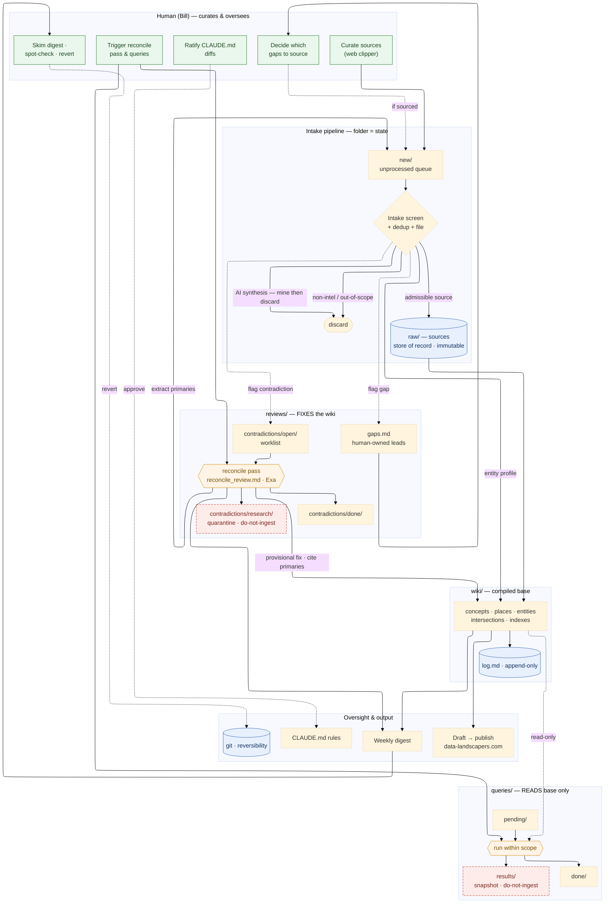

# Data Landscapers wiki — whole-project workflow

How material moves through the system: the human curates and oversees; CC runs
three separate pipelines over a single canonical base. **Blue = store of record ·
red dashed = do-not-ingest quarantine · green = human touchpoint · amber =
on-request pass.** `reviews/` *fixes* the base, `queries/` only *reads* it, and
they never cross.

> Layout uses the ELK engine (`config: layout: elk`). Recent Obsidian renders it;
> if yours doesn't, delete the two `config` lines to fall back to the default
> layout, or use the rendered SVG/HTML alongside this file.

## Reading it

- **One canonical base.** `raw/` holds sources of record (immutable); `wiki/` is
  the compiled synthesis; `log.md` records what happened. Everything else is a
  queue, a lead, or a snapshot.
- **The intake loop is the spine.** Clips land in `new/`, get screened and filed,
  and update the wiki. Two things also feed *back* into `new/`: primaries the
  reconcile pass extracts, and gaps the human chooses to source — so both
  re-enter through the same front door and the normal admissibility screen.
- **Reviews fix, queries read.** The reconcile pass (contradictions only) writes
  provisional fixes to the wiki, quarantining its research; queries only read the
  base and write disposable snapshots. Neither quarantine ever crosses into
  `raw/`.
- **Gaps stay human.** They sit in `gaps.md` until the human decides to source
  one; the reconcile pass never touches them.
- **Oversight is git-backed.** The weekly digest is the skim surface; git makes
  any provisional call a revert. CLAUDE.md rule changes are the one gate that
  requires explicit human ratification.

*(Not drawn, to keep the map legible: git underpins every store; CLAUDE.md rules
govern the whole pipeline; and a piece once published on data-landscapers.com can
re-enter via `new/` as admissible expert analysis.)*
